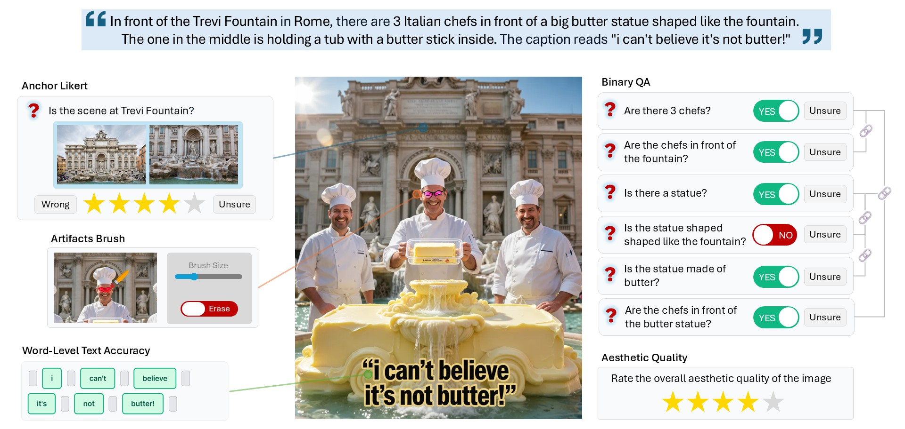

# Skill-Aligned Annotation for Reliable Evaluation in Text-to-Image Generation

<p align="center">
  <a href="#"></a>
  <a href="https://abdo-eldesokey.github.io/skill-aligned-eval/"></a>
  <a href="#"></a>
  <a href="https://creativecommons.org/licenses/by/4.0/"></a>
</p>

<p align="center">
  Abdelrahman Eldesokey, Merey Ramazanova, Ahmad Sait, Ansar Khangeldin, Karen Sanchez, Tong Zhang, Bernard Ghanem<br>
  <em>King Abdullah University of Science and Technology (KAUST)</em>
</p>

<p align="center">
  
</p>


## Abstract

> Text-to-image (T2I) generation has advanced rapidly, making reliable evaluation critical as performance differences between models narrow.
Existing evaluation practices typically apply uniform annotation mechanisms, such as Likert-scale or binary question answering (BQA), across heterogeneous evaluation skills, despite fundamental differences in their nature. In this work, we revisit T2I evaluation through the lens of *skill-aligned* annotation, where annotation strategies reflect the underlying characteristics of each evaluation skill.
We systematically compare skill-aligned annotation against uniform baselines and show that it produces more consistent evaluation signals, with higher inter-annotator agreement and improved stability across models. Finally, we present an automated pipeline that instantiates the proposed evaluation protocol, enabling scalable and fine-grained evaluation with spatially grounded feedback.
Our work highlights that improving the foundations of image evaluation can increase reliability and efficiency without simply scaling annotation effort. We hope this motivates further research on refining evaluation protocols as a central component of reliable model assessment.

## Installation

We use [`uv`](https://docs.astral.sh/uv/) for environment management. The setup script installs `uv` if missing, materializes the environment from `uv.lock`, downloads the dataset from Google Drive, and seeds `.env`.

```bash
# macOS / Linux / WSL / Git-Bash
bash setup.sh

# Windows PowerShell 5.1+
powershell -ExecutionPolicy Bypass -File setup.ps1
```

Then add your `OPENAI_API_KEY` to `.env` to enable LLM-evaluation features. The annotation viewer and analysis scripts that only consume pre-recorded annotations work without an API key.

---

## Dataset

The dataset is released as a single archive `skill-aligned-eval-assets.tar.gz` hosted on **Google Drive**.

🔗 **Download:** <https://drive.google.com/file/d/1SdLBIfSK9jKPl4Z3y95bds6jrIdt0_sG/view>

The setup scripts fetch the archive with [`gdown`](https://github.com/wkentaro/gdown) and extract it automatically.

After extraction, the archive populates [`assets/`](assets/):

| Path | Contents |
|---|---|
| `assets/images/` | Generated images, organized by generator. |
| `assets/anchors/` | Anchor reference images used by anchor-based strategies. |
| `assets/annotations/` | One JSON per (skill, strategy) keyed by anonymized annotator id. |
| `assets/ai_answers/` | LLM-judge annotations matched to the same prompts. |
| `assets/generation_prompts/` | Skill-tagged prompts used to generate the images. |
| `assets/tagging_prompts/` | LLM prompts used for skill tagging. |

Annotators are anonymized as `annotator_01..06` (humans) and `llm_judge:<model>` (LLM). A Croissant 1.0 metadata file is provided in [`croissant.json`](croissant.json).

**License.** Annotations, prompts, and code are released under **CC BY 4.0**. Generated images carry each generator's terms.

---

## Reproducing the paper

All result-producing scripts read from `assets/` and are runnable with `uv run`.

| Script | Result reproduced |
|---|---|
| [`analysis/analyze_anchor_based.py`](analysis/analyze_anchor_based.py) | Krippendorff's α and inter-annotator agreement for anchor-based strategies. |
| [`analysis/analyze_text_based.py`](analysis/analyze_text_based.py) | Agreement and accuracy for per-word and Likert text-rendering strategies. |
| [`analysis/analyze_artifacts.py`](analysis/analyze_artifacts.py) | Agreement for the artifact-Likert and brush-mask strategies. |
| [`analysis/analyze_full_evaluation.py`](analysis/analyze_full_evaluation.py) | Per-model, per-skill scores on the full evaluation set. |
| [`analysis/analyze_inter_llm_agreement.py`](analysis/analyze_inter_llm_agreement.py) | α across LLM judges (model variants). |
| [`analysis/analyze_llm_human_correlation.py`](analysis/analyze_llm_human_correlation.py) | Spearman / Pearson correlation between LLM and human means, per skill. |
| [`analysis/analyze_strategy_ranking.py`](analysis/analyze_strategy_ranking.py) | Rank correlation of generator rankings across the 9 strategies. |

Example:

```bash
uv run python analysis/analyze_llm_human_correlation.py
```

---

## Annotation interface

The web UI used to collect the human annotations is included for inspection and re-use:

```bash
uv run python -m apps.image_evaluation_app   # http://localhost:5002
uv run python -m apps.prompts_selection_app  # http://localhost:5000
uv run python -m apps.prompts_viewer_app     # http://localhost:5001
```

The image-evaluation app supports anchor-based binary QA, Likert ratings, per-word text rendering, brush masks for artifacts, and an *Auto-evaluate with LLM* mode that delegates the same protocol to an LLM judge.

---

## Extending the benchmark

The data pipeline scripts under [`scripts/`](scripts/) regenerate parts of the dataset and are **not** required to reproduce the paper.

- `sample_prompts.py` — stratified sampling from a source prompt pool.
- `tag_gecko_prompts.py` / `retag_prompts.py` — LLM-based skill tagging.
- `generate_images_runware.py` — image generation via Runware (requires `RUNWARE_API_KEY`).
- `generate_and_download_anchors.py` — fetch anchor images for skills that need them.
- `automated_llm_evaluation.py` — run the entire annotation protocol with an LLM judge.
- `anonymize_assets.py` — anonymize annotator identifiers.
- `build_release_archive.py` — package `assets/` for release.

---

## Repository layout

```
.
├── apps/        # Flask annotation / browsing interfaces
├── analysis/    # Paper-result scripts (tables, plots)
├── scripts/     # Data-pipeline scripts (regeneration, anonymization, release)
├── utils/       # Metrics, prompt utilities, skill taxonomy, LLM client
├── assets/      # Dataset (fetched by setup; excluded from git)
├── croissant.json
├── setup.sh / setup.ps1
└── pyproject.toml
```

---

## Citation

If you find this work useful, please cite:

```bibtex
@inproceedings{skillaligned2026,
  title     = {Skill-Aligned Annotation for Reliable Evaluation in Text-to-Image Generation},
  author    = {TBD},
  booktitle = {TBD},
  year      = {2026}
}
```

## Acknowledgements

*Acknowledgements to be added upon de-anonymization.*

## License

- **Code & annotations:** [CC BY 4.0](https://creativecommons.org/licenses/by/4.0/).
- **Generated images:** subject to each generator's terms.
